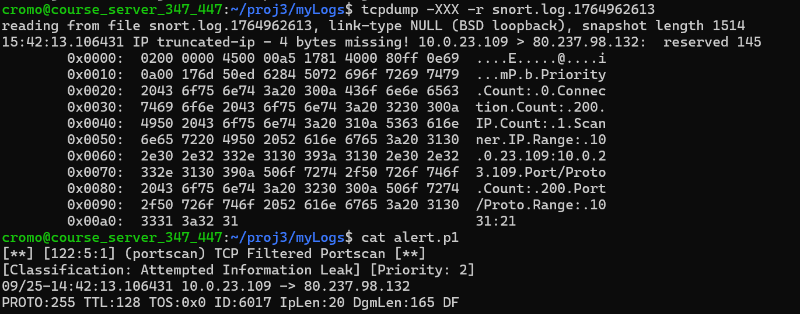
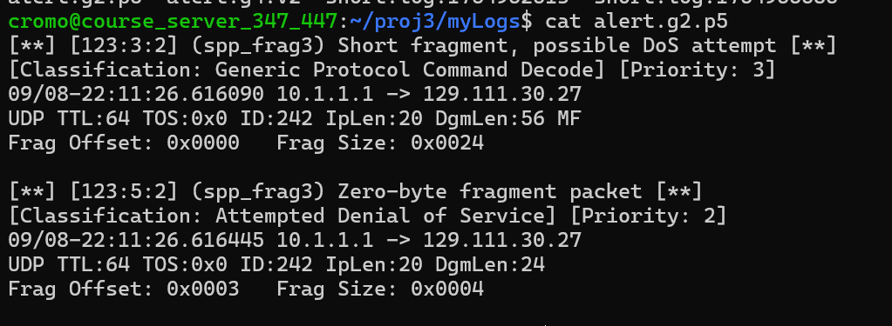
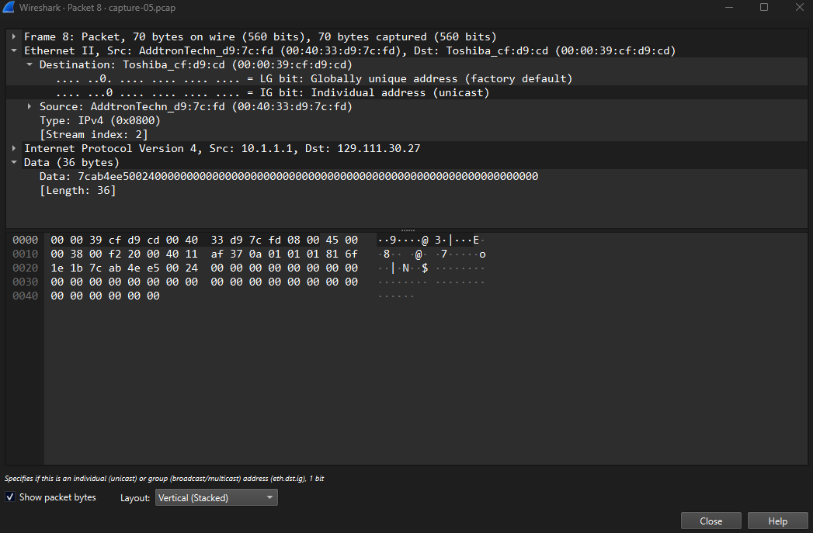
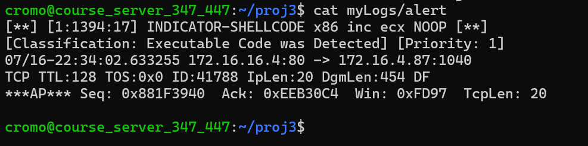
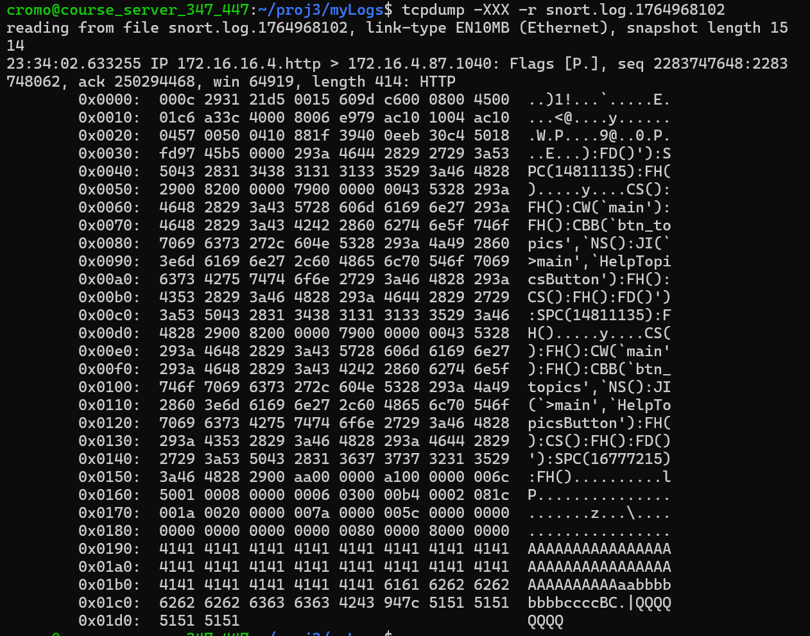
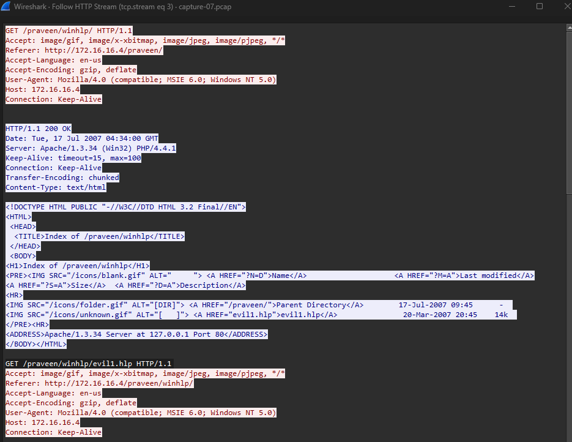
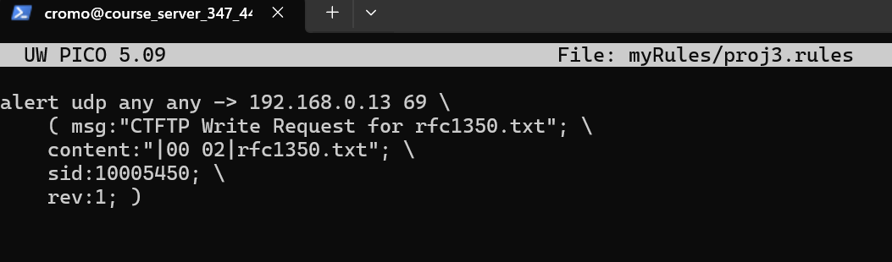
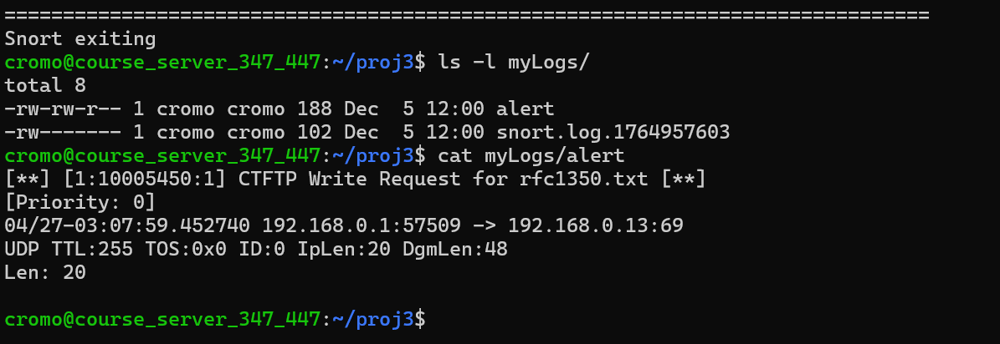
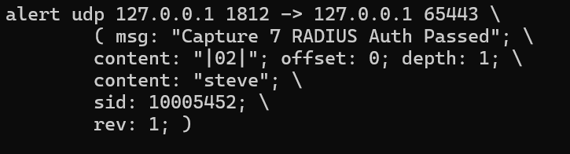
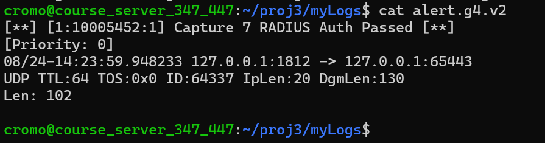

# Snort IDS Alert Analysis and Custom Rules

I worked through this project in December 2025 as part of my undergraduate cybersecurity coursework. The setup was that I had just been hired as a network analyst, my first assignment was to start tuning an IDS sensor running Snort (an open-source intrusion detection system that watches network traffic and fires an alert when something matches a rule), and I had a set of packet captures to review. Some captures would trigger alerts on their own, and others needed custom signatures written from scratch.

The goal was to take an alert, figure out what it actually meant, and then prove it by looking at the packets themselves.

> The `.pcap` files and the assignment prompt belong to the course, so they are not included in this repo. Everything here is my own analysis and my own rules.

## What I Found

- **Port scan:** One host (10.0.23.109) scanned 80.237.98.132 at about 25.7 packets per second, hitting ports in random order.
- **Fragmentation DoS:** Malformed UDP fragments from 10.1.1.1, including a zero-byte fragment, which Snort flagged as a possible denial of service attempt.
- **Shellcode:** A NOP sled inside a web server's response, which led me to a malicious Windows Help file (`evil1.hlp`) the client downloaded.

## Tools

- **Snort** for running the captures and writing custom signatures
- **tcpdump** (`-XXX -r`) for hex dumps of the packets and the Snort logs
- **Wireshark** for statistics, packet details, and following HTTP streams
- Linux command line on the course server, with logs kept in `myLogs/` and my rules in `myRules/proj3.rules`

Every capture followed the same loop. I ran Snort against the capture and read the alert file, then went back to the raw traffic with tcpdump and Wireshark to confirm what Snort told me and to fill in the details the alert didn't give.

---

## Port Scan

**Alert:** `[122:5:1] (portscan) TCP Filtered Portscan` (Attempted Information Leak, priority 2)



A port scan is one machine knocking on a bunch of ports on another machine to see which ones answer. Snort has to be configured to detect and log port scans before it reports them, so getting this alert at all meant setting that up first.

| Detail | Finding |
|---|---|
| Scanner (source IP) | 10.0.23.109 |
| Target (destination IP) | 80.237.98.132 |
| Packet rate | 1000 packets / 38.858 seconds = about 25.7 packets per second |
| Ports | Chosen at random, not stepped through in order |

The hex dump of the Snort log was the most useful part for me, since the scan summary is sitting right there in the ASCII column (Connection Count 200, IP Count 1, Port/Proto Count 200, ports 21 through 1031). From my understanding that summary is Snort's own count, meaning it backed up the numbers I pulled out of Wireshark instead of leaving me to trust only my own math.

---

## Fragmented Packets

**Alerts:** two from Snort's fragment handling (`frag3`), both from the same source

- `[123:3:2] Short fragment, possible DoS attempt` (priority 3)
- `[123:5:2] Zero-byte fragment packet` (Attempted Denial of Service, priority 2)



| Detail | Finding |
|---|---|
| Source IP | 10.1.1.1 |
| Destination IP | 129.111.30.27 |
| Protocol | UDP |
| Ports | Consistent, not random (31915 to 20197) |
| Timing | Sub-second, the whole event sits between 9.61 and 9.62 seconds in the capture |

Both alerts carry the same IP ID (242), which tells me they belong to the same fragmented datagram, and they fired about a third of a millisecond apart. In Wireshark, packet 8 shows a 36-byte payload that starts with the UDP header and then runs out into nothing but zeros.



**My summary:** it looks like an attacker is sending an abnormally small packet with a payload filled with 0's, which is what trips the zero-byte fragment alert. I think this is a denial of service attempt and not an attempt to move data, since there is nothing in that payload to read.

---

## Shellcode in an HTTP response

**Alert:** `[1:1394:17] INDICATOR-SHELLCODE x86 inc ecx NOOP` (Executable Code was Detected, priority 1)



The alert fired on a response from the web server at 172.16.16.4 (port 80) going back to the client at 172.16.4.87. That direction matters, meaning the suspicious content was being delivered to the client, not sent by it.

**What the alert means.** On x86, the byte `0x41` is the instruction `inc ecx` (add one to a register), which does nothing useful on its own. Attackers use long runs of it as filler to build a NOP sled (a stretch of harmless instructions that lets execution slide forward into the real shellcode), and that is what this rule looks for. From my understanding this is the classic shape of a buffer overflow attempt.

**What the packet shows.** The hex dump has a long wall of `41` bytes (the A's in the ASCII column), and a run of `51` bytes (QQQQ) near the end that I read as part of the shellcode.



**The malicious payload: `evil1.hlp`.** Following the HTTP stream in Wireshark, the client first requested a directory listing at `/praveen/winhlp/` and then requested `/praveen/winhlp/evil1.hlp` directly. The server was running Apache 1.3.34 on Windows with PHP 4.4.1, and the client was Internet Explorer 6.



A `.hlp` file is a Windows Help file, so my best guess is that the file was the delivery vehicle and the target was whatever opens it on the client side.

---

## Writing Custom signatures

Both of these captures were normal traffic, but the company wanted an alert any time a specific event happened. Each rule needed to fire exactly once on its capture. The full rules are in [`rules/proj3.rules`](rules/proj3.rules).

### TFTP write request (`capture-08-p01.pcap`)

```
alert udp any any -> 192.168.0.13 69 ( msg:"CTFTP Write Request for rfc1350.txt"; content:"|00 02|rfc1350.txt"; sid:10005450; rev:1; )
```



In TFTP, opcode `0x0002` is a write request and the filename comes right after it (per RFC 1350), so matching `|00 02|rfc1350.txt` going to the TFTP server on port 69 catches that exact file being written.



### RADIUS authentication passed (`capture-10-p08.pcap`)

```
alert udp 127.0.0.1 1812 -> 127.0.0.1 65443 ( msg: "Capture 7 RADIUS Auth Passed"; content: "|02|"; offset: 0; depth: 1; content: "steve"; sid: 10005452; rev: 1; )
```



The first byte of a RADIUS packet is its code, and `0x02` means Access-Accept (a successful login). The `offset: 0; depth: 1` part tells Snort to only look at that first byte, and the second `content` match on `steve` narrows it down to the backup account.



---

## Skills Used

Snort rule writing and tuning, IDS alert triage, packet analysis (Wireshark and tcpdump), reading hex dumps, port scan and fragmentation attack recognition, shellcode and NOP sled identification, TFTP and RADIUS protocol basics, Linux command line, technical writing

## What I Learned

**An alert is the start of the investigation, not the end of it.** Snort told me a port scan, a short fragment, and shellcode were present, but it took tcpdump and Wireshark to see what the traffic really looked like and to pull out the details that matter, like the scanner IP, the packet rate, and the name of the file (`evil1.hlp`).

**Hex gets readable faster than I expected.** Once a few values click, `0x41` is `inc ecx` (so a wall of A's is a red flag), `0x0002` at the front of a TFTP packet is a write request, and `0x02` as the first byte of a RADIUS packet is a successful login.

**A good signature is specific enough to fire once, on the right thing.** A content match with no limits can trigger on a stray `02` anywhere in the payload, so `offset` and `depth` mattered, and combining them with the username is what made the RADIUS rule actually mean something.

**Research is part of the job.** I had to look up what `INDICATOR-SHELLCODE x86 inc ecx NOOP` meant before I could explain it, and I think that is close to what an analyst does with any alert they haven't seen before.

## Repo Contents

```
.
├── README.md
├── rules/
│   └── proj3.rules
└── images/
    └── (screenshots used above)
```
